# Artist Identification
This project aims to develop a machine learning model to identify and classify artistic styles in illustrations (digital images). The main focus is to identify the particular style of an artist (**@avogado6**) through illustrations featuring people.

## Student Information
- **Name:** Ana Karen López Baltazar
- **ID:** A01707750

## Dataset
### Dataset Origin
The dataset used in this project comes from three main sources:

1. **@avogado6**: Illustrations from the artist whose style is being identified. Images retrieved from their [homepage](https://www.avogado6.com/).
2. **@FutarinoTaiyou**: Illustrations from another artist with a similar style. Images retrieved from their [Twitter account](https://twitter.com/futarinotaiyou?lang=es).
3. **Kaggle Dataset**: An additional image set obtained from a Kaggle dataset ([Pixiv Top Daily Illustration 2020](https://www.kaggle.com/datasets/stevenevan99/pixiv-top-daily-illustration-2020)) to complement the image collection.

### Image Selection
The images selected for this project focus on illustrations of people created by the primary artist. Images representing different angles and perspectives of people, including front, side, and partially obscured views, have been included.

### Dataset Split
The dataset was split into training and test sets randomly. 80% of the images were assigned to the training set (from which 20% were further used for model validation), and the remaining 20% were allocated to the test set, ensuring an equitable distribution of images between both sets.

- Training Set: 416 images
- Validation Set: 104 images
- Test Set: 130 images

To access the complete dataset used in this project, you can visit the following [Drive link](https://drive.google.com/drive/folders/1CXb4dSFhRqj9K56XZ_WWbyvf4POauS17?usp=sharing).

***Note:** This division corresponds solely to the "*first version*" of the dataset. The "*second version*" is explained later in the *Model Refinement*.

### Image Preprocessing
Before feeding image data into the neural network model, it's essential to perform proper preprocessing to ensure better training performance and model generalization. In this process, images were resized to a uniform size of 224x224 pixels, and pixel values were scaled to the range [0, 1] by dividing each pixel value by 255.0. Additionally, data augmentation techniques were applied to the training set to artificially increase the dataset's size and improve the model's ability to generalize to unseen data.

## Model Implementation
For this project, the implemented model was inspired by the article ["Artist Identification with Convolutional Neural Networks"](https://www.semanticscholar.org/paper/Artist-Identification-with-Convolutional-Neural-Viswanathan-Stanford/dafe87bf57c4413d769de46af78f7e4305087838), which proposes a similar approach to identify artistic styles. A ResNet-18 architecture was adapted for this specific task, modifying the final layers to perform binary classification between images of the target artist and those of other artists.

## Model Evaluation Metrics
The model will be evaluated using the following metrics:
- **Accuracy**: Proportion of correct predictions over the total predictions made.
- **Confusion Matrix**: Table showing predictions versus true labels.
- **Precision**: Proportion of true positives over the total positive predictions.
- **Recall**: Proportion of true positives over the total actual positives.
- **F1 Score**: Harmonic mean between precision and recall.

## Initial Evaluation
### Evaluation Results
Below are the results obtained when evaluating the model on the test set:

- **Confusion Matrix**

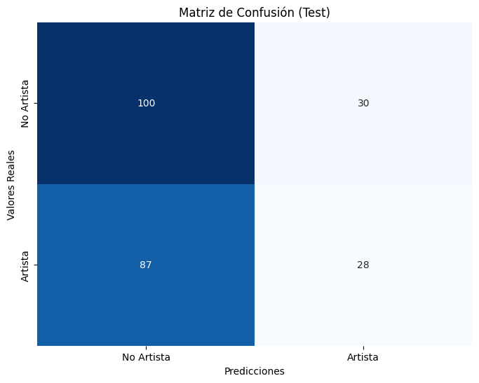

- **Classification Report**

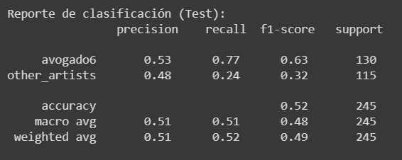

- **Predictions**

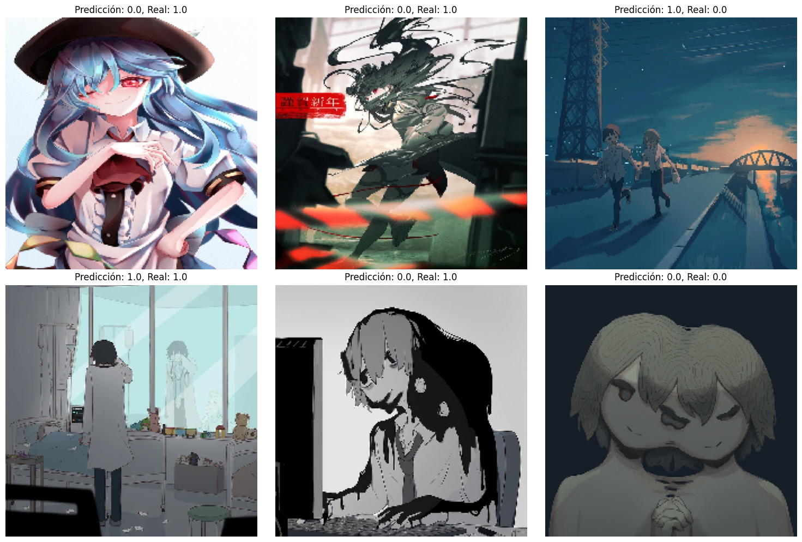

- **Loss y accuracy**

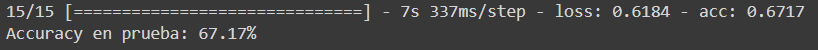

- **Interpretation**

The model achieves an accuracy of 53% in identifying images of the artist and 48% for images of other artists. However, its ability to correctly identify images of other artists is limited (recall of 24%) [weakness in its generalization capacity and differentiation between artistic styles]. Therefore, the model needs improvements to balance its ability to correctly identify both images of the artist and other artists.

### Model Correction
After an initial evaluation of the model, it was identified that the layers of the pretrained model were being trained, which was not desired for this case. To correct this, the code was modified by moving the line `base_model.trainable = False` just after the creation of the original model. This ensures that only the custom layers added to the model are trained, keeping the pretrained layers unchanged. After making this change, the model was recompiled and trained, and the updated results are shown.

- **Confusion Matrix**

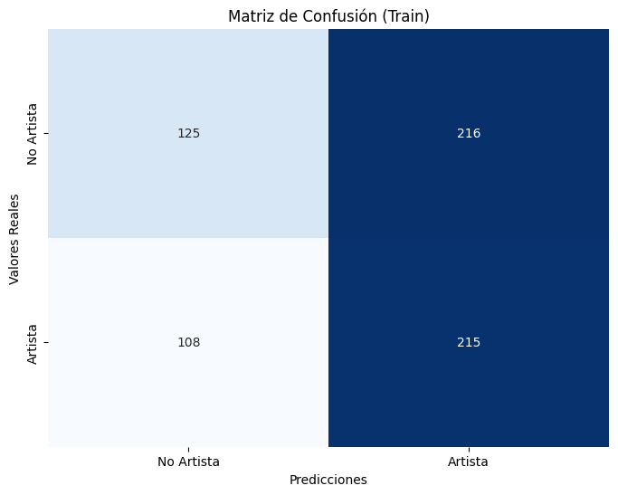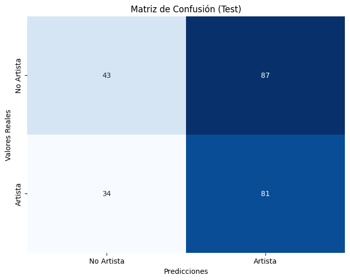

- **Classification Report**

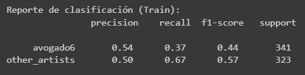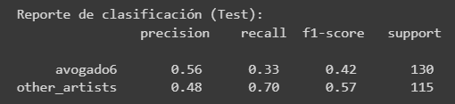

- **Loss y accuracy**

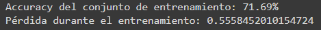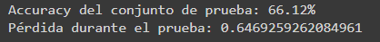

## Model Refinement
After evaluating the base model's performance, an overfitting problem was observed, where the model showed better performance on the training set than on the test set. To address this issue and improve the model's generalization ability, the following modifications were implemented.

First, **L2 regularization** and **dropout with a 50% rate** were incorporated into the dense layers to prevent overfitting. Additionally, **data augmentation techniques** were applied, including horizontal and vertical shifting, zooming, and horizontal flipping, to enhance the model's ability to generalize to new samples.

Furthermore, a ***second version* of the dataset** was generated, where additional images were added, thus increasing the number of samples available for model training and testing. In this new version, the same distribution previously mentioned between training, testing, and validation was maintained, resulting in each classification element having the following image distribution:

- Training Set: 736 images
- Validation Set: 184 images
- Test Set: 230 images

Finally, **callbacks were used during training** to save the updated model after each epoch and select the best model based on accuracy on the validation set.

## Model Results and Comparison
### Modified Model Results
Below are the results obtained with the modified model:
- **Confusion Matrix**

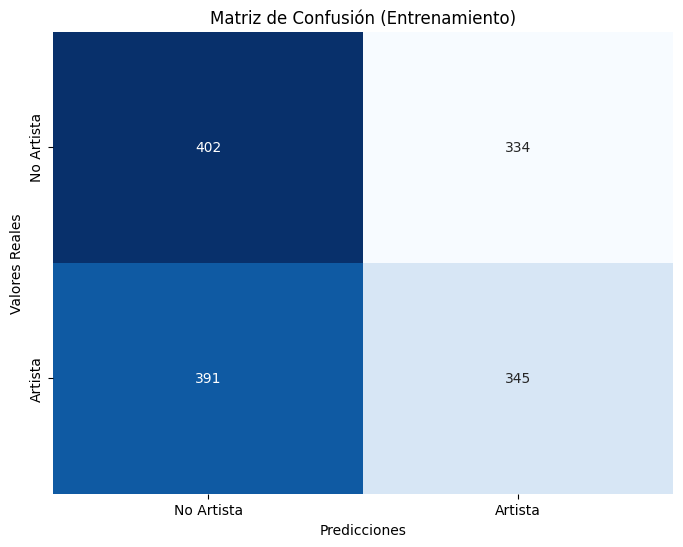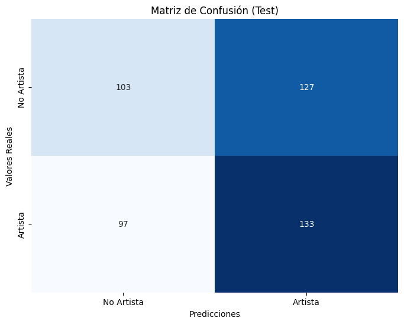

- **Classification Report**

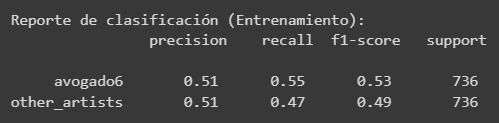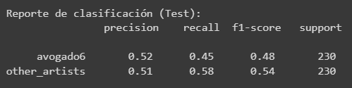

- **Loss y accuracy**
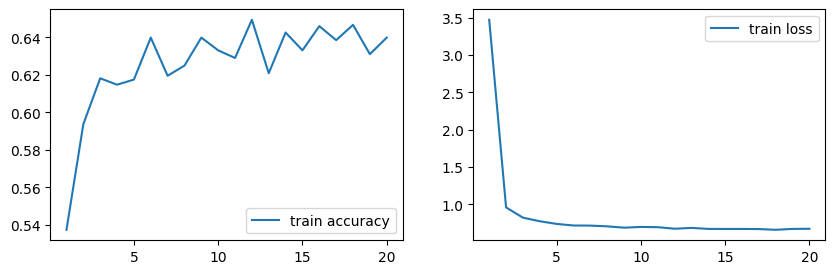

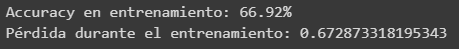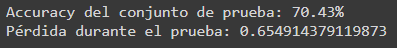

### Comparison with Base Model
The modified model has demonstrated improved performance compared to the base model. In the training set, the modified model achieved an accuracy of 66.92% with a loss of 0.67, while the base model achieved an accuracy of 71.69% with a loss of 0.56. However, in the test set, the modified model showed an accuracy of 70.43%, surpassing the base model that achieved an accuracy of 66.12%. These results indicate an improvement in the model's generalization ability, as it achieves higher accuracy on a previously unseen dataset. Although the base model had slightly superior performance in the training set, the modified model demonstrated better ability to generalize to new data.

Finally, despite the improvements observed in the model's accuracy, there are still challenges to overcome in the model for the correct classification of images, especially in the identification and distinction between the avogado6 and non-artist categories. The model continues to show difficulties in discerning between avogado6's artworks and those not belonging to this category. To address these challenges, additional adjustments to the model's hyperparameters and exploration of other architectures could be considered. However, there are no intentions to integrate these ideas into the existing code at this time.

