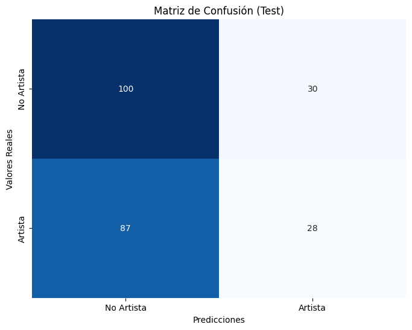
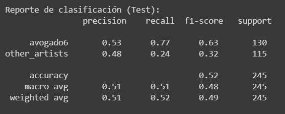
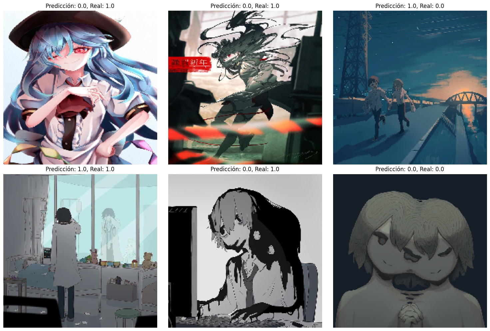

# Artist Identification
Este proyecto tiene como objetivo desarrollar un modelo de aprendizaje automático para identificar y clasificar estilos artísticos en ilustraciones (imágenes digitales). El enfoque principal es identificar el estilo particular de un artista (**@avogado6**) a través de ilustraciones donde haya personas.

## Información del Alumno
- **Nombre:** Ana Karen López Baltazar
- **Matrícula:** A01707750

## Conjunto de datos
### Origen del Conjunto de Datos
El conjunto de datos utilizado en este proyecto proviene de tres fuentes principales:

1. **@avogado6**: Ilustraciones del artista cuyo estilo se busca identificar. Imágenes recuperadas de su [página principal](https://www.avogado6.com/).
2. **@FutarinoTaiyou**: Ilustraciones de otro artista con un estilo similar. Imágenes recuperadas de su cuenta de [Twitter X](https://twitter.com/futarinotaiyou?lang=es).
3. **Kaggle Dataset**: Un conjunto de imágenes adicional obtenido de un dataset en Kaggle ([Pixiv Top Daily Illustration 2020](https://www.kaggle.com/datasets/stevenevan99/pixiv-top-daily-illustration-2020)) para complementar el conjunto de imágenes.

### Selección de Imágenes
Las imágenes seleccionadas para este proyecto se centran en ilustraciones de personas realizadas por el artista principal. Se han incluido imágenes que representan diferentes ángulos y perspectivas de las personas, incluyendo vistas de frente, de lado y parcialmente ocultas.

### División del Conjunto de Datos
El conjunto de datos se dividió en conjuntos de entrenamiento y prueba de manera aleatoria. Se asignó el 80% de las imágenes para el conjunto de entrenamiento (del cual a su vez se utilizó el 20% para la validación del modelo) y el 20% restante para el conjunto de prueba, asegurando una distribución equitativa de las imágenes entre ambos conjuntos.

- Conjunto de Entrenamiento: 416 imágenes
- Conjunto de Validación: 104 imágenes
- Conjunto de Prueba: 130 imágenes
  
Para acceder al conjunto de datos completo utilizado en este proyecto, puedes visitar la siguiente liga de [Drive](https://drive.google.com/drive/folders/1CXb4dSFhRqj9K56XZ_WWbyvf4POauS17?usp=sharing).

### Preprocesamiento de Imágenes
Antes de alimentar los datos de imágenes al modelo de red neuronal, es esencial realizar un preprocesamiento adecuado para garantizar un mejor rendimiento de entrenamiento y generalización del modelo. En este proceso, las imágenes se redimensionaron a un tamaño uniforme de 224x224 píxeles y los valores de píxeles se escalonaron al rango [0, 1] dividiendo cada valor de píxel por 255.0. Además, se aplicaron técnicas de aumento de datos al conjunto de entrenamiento para incrementar artificialmente el tamaño del conjunto de datos y mejorar la capacidad del modelo para generalizar a datos no vistos. 

## Implementación del Modelo
Para este proyecto, el modelo implementado se insipiró en el artículo ["Artist Identification with Convolutional Neural Networks"](https://www.semanticscholar.org/paper/Artist-Identification-with-Convolutional-Neural-Viswanathan-Stanford/dafe87bf57c4413d769de46af78f7e4305087838), donde se propone un enfoque similar para identificar estilos artísticos. Se adaptó una arquitectura ResNet-18 para esta tarea específica, modificando las capas finales para realizar una clasificación binaria entre las imágenes del artista objetivo y las de otros artistas.

## Métricas de Evaluación del Modelo
El modelo se evaluará utilizando las siguientes métricas:
- **Accuracy**: Proporción de predicciones correctas sobre el total de predicciones realizadas.
- **Matriz de Confusión**: Tabla que muestra las predicciones versus las etiquetas verdaderas.
- **Precision**: Proporción de verdaderos positivos sobre el total de predicciones positivas.
- **Recall**: Proporción de verdaderos positivos sobre el total de positivos reales.
- **F1 Score**: Media armónica entre precisión y recall.

## Resultados de la Evaluación
A continuación, se presentan los resultados obtenidos al evaluar de forma inicial el modelo en el conjunto de prueba:

- **Matriz de Confusión**

- **Informe de Clasificación**

- **Predicciones**

- **Loss y accuracy**

- **Interpretación**

El modelo logra una precisión del 53% en identificar imágenes del artista y del 48% para otras imágenes de artistas. Sin embargo, su capacidad para identificar correctamente imágenes de otros artistas es limitada (recall del 24%) [debilidad en su capacidad de generalización y diferenciación entre estilos artísticos]. Por tanto, el modelo necesita mejoras para equilibrar su capacidad de identificar correctamente tanto imágenes del artista como de otros artistas.
